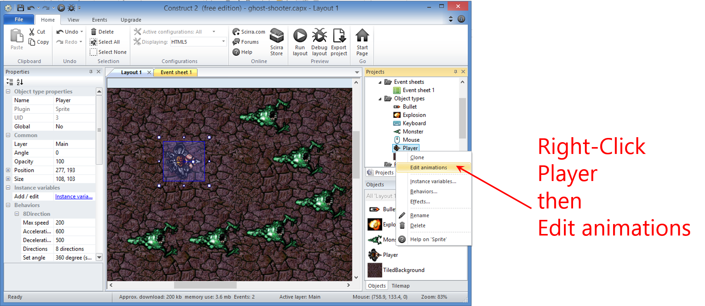

# Intro to Construct 2

## Objective:
1. Understand the basics of using Construct 2.
2. Build a cool Ghost Shooter game using Construct 2

## Getting Started
Download and install [Construct 2](https://www.scirra.com/construct2)

Run Construct 2

Once it's open click **"File>New"** 

Open up a new 'Empty Project' or choose from a variety of 'Templates'

You can even search and filter. 

Here is a breakdown of the Project Environment, which you'll become very familiar: 

Once you've opened your Template or Empty Project go ahead and click **"File>Save"**

## Going Multiplatform

### Step 1: 
First you'll need to export your project. Click **"File>Export"**

### Step 2:
Choose a platform:

Web (HTML5 website, etc.)

Mobile (PhaseGap, WP8, etc.)

Desktop (Windows 8)

### Step 3:
Publish anywhere:

HTML5 website --> web server

Scirra Arcade

WP8 or Windows 8
PhoneGap --> iOS or Android

# Creating Tiled Backgrounds
Right-click Inside the Layout area and select **"Insert new object"**

Select **"Tiled Background"** and click **"Insert"**

Then click inside the Layout area then click **"Open Icon"** to load an image:

Select **bg.png** from the images folder. (*Note: this may look different on your computer*)

Close the preview pop-up window and you'll notice extra space in the Layout area. 

## Special Note:
Remember you need to know your X and Y. 

Now update your tile positions:

Select Layout 1 and Update your sizes:

Now when you zoom in or out you can only see the Tiled Background. 

## Adding Layers
Start by clicking the layers tab on the right:

Click the **"Edit icon"** (pencil) to rename Layer 0. Rename it to *"Background"* and click the **"Lock Symbol"**

Add a new layer by pressing the **"Plus Sign Icon"**

Then, again, click the **"Edit icon"** (pencil) to rename the Layer. Rename it to *"Main"* and click the **"Lock Symbol"**

That's it for layers!

## Mouse & Keyboard Support (aka Hidden Objects)

Start by selecting the **"Main Layer"**

Right click and select **"Insert new object"**:

Select **"Mouse Icon"** then click **"Insert"**

Again, right click andselect **"Insert new object"**:

Select **"Keyboard Icon"** then click **"Insert"**

Notice both Mouse and Keyboard are added to objects:

## Sprites & Game Characters

As before, right click and select **"Insert new object"**

Select the **"Sprite Icon"** then click **"Insert"**

Click inside Layout area:
 then click the **"Open Icon (folder)"** to load an image.

Select **player.png** from the images folder and click **"Open"**

Close the pop-up window and you'll see your Sprite character in the Layout window.

## Adding Non-Playable Characters (NPCs)

For this game we're going to add Monsters! Very similar to adding playable Sprites. 

As before, right click and select **"Insert new object"**

As before, select the **"Sprite Icon"** then click **"Insert"**

Click inside Layout area:
 then click the **"Open Icon (folder)"** to load an image.

Select **monster.png** from the images folder and click **"Open"**

Close the pop-up window and you'll see your Monster character in the Layout window.

## Adding Other Game Objects
We'll be adding in bullets and explosions!

As before, right click and select **"Insert new object"**

Select the **"Sprite Icon"** then click **"Insert"**

Click inside Layout area:
 then click the **"Open Icon (folder)"** to load an image.

Select **bullet.png** from the images folder and click **"Open"**

Close the pop-up window and you'll see your Bullet in the Layout window.

As before, right click and select **"Insert new object"**

Select the **"Sprite Icon"** then click **"Insert"**
 
Click inside Layout area then click the **"Open Icon (folder)"** to load an image.

Select **explode.png** from the images folder and click **"Open"**

Close the pop-up window and you'll see your Explosion in the Layout window.

## Organizing Your Layout
Now we're going to rename your Sprites and arrange them properly. 

First, Right-click to rename each Sprite:

**Rename them:**

Player

Monster

Bullet

Explosion

Next, Zoom-out in the Layout window so you can see the end of the Background Tile.

Then move the Bullet and Explosion outside the Layout, like:

It should now look like:

## Player Movement
Let's get things moving!

First, select your Player from the Projects window on the right.

Click, **"Behaviors"** 

Then **"Add New"** 

Choose your Movement:

Select **"8 Direction"** and then click **"Add"**

Repeat the steps above (the last 4) but this time select **"Scroll To"** from the Movement selector.

Repeat the same steps above but this time select **"Bound to Layout"** from the Movement selector.

Then close the pop-up. 

## Adding Behaviors

Very similar to adding Player Movements. 

As before, select **"Bullet"** from the Projects window. Then **"Behaviors"** 

Then **"Add New"** 

Select **"Bullet"** and then click **"Add"**

With **"Bullet"** still selected click **"Add New"** again and select **"Destroy Outside Layout"** and then click **"Add"**  

Close the pop-up

Repeat those steps but this time first select **"Explosion"** from the Project window, then select **"Fade"** from the Behaviors list. 

Close the pop-up.

Now we need to update the speed and fade out timing. 

Update the Properties of each item to:

## Moving NPCs

First let's move the Monster.

Very similar to adding previous Movements. 

As before, select **"Monster"** from the Projects window. Then **"Behaviors"** 

Then **"Add New"** 

Select **"Bullet"** and then click **"Add"**

Close the pop-up.

Now we need to update the speed like before. 

Once updated let's add more Monsters. 

##Accepting User Input

Let's add events to the Event Sheet:

An **"Event"** happens when a Condition is true for an object:

Right-click then **"Add Event"**:

Select **"System"** then **"Next"**
Select **"Every Tick"** then **"Done"**
 Click to **"Add Action"**:

Select **"Player"** then **"Next"**
Select **"Set angle toward position"** then **"Next"**

Enter Parameters:

Should end up looking like this:

## Spawning Other Objects

Other objects, for example, bullets.

Click to **"Add Event"**:

Select **"Mouse"** then **"Next"**
Select **"On click"** then **"Next"**

Click **"Done"**:

Click to **"Add Action"**:

Select **"Player then"** then **"Next"**
Scroll down a bit and select **"Spawn another"** then **"Next"**

In the pop-up window click **"Click to choose"**
Select **"Bullet"** then **"OK"**

Enter Layer and Image Point values:

Should look like this:

## Image Points

Here we'll fix your Bullets.

To start Right-click **"Player"** then **"Edit Animations"**:

Then: 

Click to **"Add (plus symbol+)"**

Then:

Then:

Then update **"Image Point"** to equal **"1"** and click **"Done"** 

## Collision Detection

Let's Destroy some Monsters.

As before, click to **"Add Event"**

Select **"Bullet"** then **"Next"**
Select **"On collision with another object"** then **"Next"**

In the Object select click **"Click to choose"**

Select **"Monster"** then **"OK"**
Then click **"Done"**

Next we'll do these steps again. 
As before, click to **"Add Event"**

Select **"Monster"** then **"Next"**
Scroll down a bit, then select **"Destroy"** then **"Done"**

Next we'll do these steps again. 
As before, click to **"Add Event"**

Select **"Bullet"** then **"Next"**
Scroll down a bit, then select **"Spawn another"** then **"Next"**

In the Object select click **"Click to choose"**

Select **"Explosion"** and then **"OK"**

Set Layer to equal **"1"** 
Set Image Point to equal **"0"**
Click **"Done"**

Next we'll do these steps again. 
As before, click to **"Add Event"**

Select **"Bullet"** then **"Next"**
Scroll down a bit, then select **"Destroy"** then **"Done"**

Your items should look like this:

## Basic AI

Let's Randomize Monsters.

First, go to your **"Event Sheet"**:

Click to **"Add Event"**:

Select **"System"** then **"Next"**
Scroll down a bit, then select **"On start of layout"** then **"Done"**

Click to **"Add Action"** 
Select **"Monster"** then **"Next"**
Select **"Set angle"** then **"Next"**
Enter Angle = **"random(360)"** then **"Done"**

Should look like this:

## Improved AI

Let's make the Monsters smarter.

As before, go to your **"Event Sheet"**

Click to **"Add Event"**

Select **"Monster"** then **"Next"**
Scroll down a bit, then select **"Is outside layout"** then **"Done"**

Click to **"Add Action"**

Select **"Monster"** then **"Next"**
Then select **"Set angle towards position"** then **"Next"**

Enter Parameters:

X= Player.X

Y= Player.Y

Should look like this:

## Instance Variables - NPC Health

The Monsters won't go down easy!

Select **"Monster"** front the Projects window

Select **"Instance Variables"**:

Click to **"Add New (plus sign)"**

Enter the following into the form:

Name = health

Type = Number

Initial Value = 5

Description = (optional)

Click **"OK"**

Right-click **"Monsters - Destroy"**
Then click **"Replace Action"**:

Select **"Monster"** then **"Next"**
Then select **"Subtract from"** then **"Next"**

Enter Value = 1

Then **"Done"**

Should look like this:

## Affecting NPC Health

Time to destroy those Monsters!

As before, go to your **"Event Sheet"**

Click to **"Add Event"**

Select **"Monster"** then **"Next"**
Scroll down a bit, then select **"Compare instance variable"** then **"Next"**

Enter Values for:

Comparison: is less or equal

Value = 0

Click **"Done"**

Next, click to **"Add Action"**

Select **"Monster"** then **"Next"**
Scroll down a bit, then select **"Spawn another object"** then **"Next"**

In the window next to **"Object"** click **click to choose**

Select **"Explosion"** then **"OK"**

Enter Values for:

Layer = 1

Image Point = 0

Click **"Done"**

Next, click to **"Add Action"** again.
Select **"Monster"** then **"Next"**
Scroll down a bit, then select **"Destroy"** then **"Done"**

Should look like this:

## Global Variables

Now we need to add some scoring.

First, Right-click in the Event sheet 1 area:

Enter Values for:

Name = Score

Type = Number

Initial Value = 0

Description = (optional)

Constant = (check the box)

Click **"OK"**

Then scroll up and it should show:

Scroll back to the bottom and click **"Add Action"**

Select **"System"** then **"Next"**
Select **"Add to"** then **"Next"**

Enter Value = 1 click **"Done"** 

Should look like this:

## Adding a Heads-Up Display (HUD)

Start by clicking **"Layers"**

Add a new layer by clicking the **"+ symbol"**

Right-click the new layer and click **"Rename"** Change the name to **"HUD"**

Now let's change the Parallax values:

----------
### Wait! What is Parallax??

Parallax is when the background layers scroll separately, e.g., the classic Super Mario Bros.

Learn more about Parallax here:
[http://wakeupandcode.com/c2/parallax.html ](http://wakeupandcode.com/c2/parallax.html  "Parallax")

----------

## Ok, back to HUD...

Let's set the HUD's parallax:

It's that simple!

## Displaying Text

Wait what's the score??

First:

Select **"Text"** then **"Insert"**
Click to place Text object:

You'll notice:

Now let's change properties:

## Updating the HUD

First we need to know how to combine text. See below:

In the game it will look like:

Now, find **"System>Every Tick"** and click **"Add Action"** 

Select **"Text"** then **"Next"**
Scroll down to select **"Set text"** then **"Next"**

Enter in the Text box:

"Score: " & Score

Click **"Done"** 

Should look like:

## Spawning NPCs

Let's add some more Monsters.

Scroll to the bottom of Event sheet window and click **"Add Event"**

Select **"System"** then **"Next"**
Scroll down to select **"Every X seconds"** then **"Next"**

Enter Interval (seconds) = 3

Click **"Done"**

Then click **"Add Action"** 

Select **"System"** then **"Next"**
Select **"Create object"** then **"Next"**

Click **click to choose** and select **"Monster"** then click **"OK"**

Enter Values for:

Layer = 1 

X = 1400

Y = random(1024)

And click **"Done"** 

Should look like this:

## Destroying the Player :*(

Sigh...

Scroll to the bottom of Event sheet window and click **"Add Event"**

Select **"Monster"** then **"Next"**
Select **"On collision with another object"** then **"Next"**

Click **click to choose** and select **"Player"** then click **"OK"**

Click **"Done"** 

Next, click **"Add Action"** 

Select **"Player"** then **"Next"**
Select **"Destroy"** then **"Done"**

Should look like this:

----------

# Wrap Up

Find more Construct 2 tutorials here:[http://www.scirra.com/tutorials ](http://www.scirra.com/tutorials )

Check out the Construct 2 Facebook Group here:[https://www.facebook.com/groups/construct2devs/ ](https://www.facebook.com/groups/construct2devs/ )

Check out the Construct 2 forums for great threads here: [https://www.scirra.com/forum/ ](https://www.scirra.com/forum/ )

## Created By
Shahed Chowdhuri

### Contact

Web: OnekSoft.com

Email: games@OnekSoft.com

Twitter: @OnekSoftGames

Microsoft email: shchowd@microsoft.com

Personal Twitter: @shahedC

R&D: OnekSoftLabs.com

Dev Blog: WakeUpAndCode.com 

FB:[ http://facebook.com/groups/XboxOneIndieDevs ]( http://facebook.com/groups/XboxOneIndieDevs )

Markdown formatting by: Matt Secord

##Resource Page
Find the image files, PowerPoints, SlideShare, etc. here:[http://wakeupandcode.com/construct2/ghost-shooter-step-by-step/](http://wakeupandcode.com/construct2/ghost-shooter-step-by-step/)

